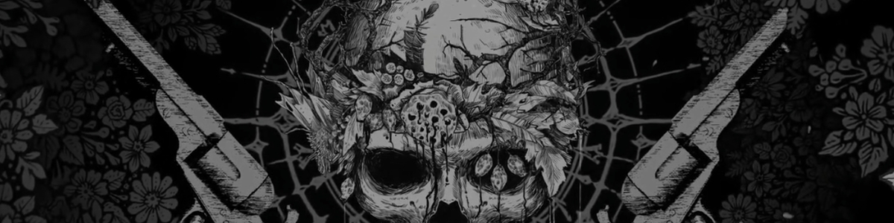

<!-- ========================================================= -->
<!--                     ibbie0 / bibi README                   -->
<!--            theme: soft anime-inspired pastel dark          -->
<!-- ========================================================= -->

<!-- 🖼️ Banner -->

  

<!-- 🩵 Intro -->
<h1 align="center">hey, i'm <b>bibi</b> 🌙</h1>
<h3 align="center">artist • designer • developer</h3>

  <em>“make it flow, make it glow.”</em>

---

### 🎨 About Me

I'm an artist and designer who sometimes codes.  
I love creating visuals, crafting UI, and experimenting with small game systems.  
My work blends **art, motion, and chill energy** — I like when things just *feel right.*

- 🧩 I make: logos, posters, UI designs, wallpapers, and pixel assets  
- 🧠 Learning: HTML, CSS, Java, Lua, Python, C++, and Godot  
- 🎮 Also create: 3D items, characters, and game GFX (Minecraft, Roblox, etc.)  
- ☕ vibe: lo-fi nights + smooth color palettes  

---

### 🧰 Tech & Tools

  <!-- art & design -->
  
   
  <!-- code -->
  
   
  <!-- misc -->
  

---

### 📊 GitHub Stats

  
  

---

### 💫 Currently

🧠 learning → idk I
🎮 playing → Hell nah I'm not playing 😤, jk.. I'm playing Minecraft 😊
💘 favorite character → Evlyn, Baldurs gate
🎧 mood → pixel lights & lo-fi sounds

---

### 🌐 Connect with Me

  
  
  
  
  

---

  
   
  
   
  <em>“building small worlds that feel alive.”</em>

<!-- ========================================================= -->
<!--                  end of profile README                    -->
<!-- ========================================================= -->
